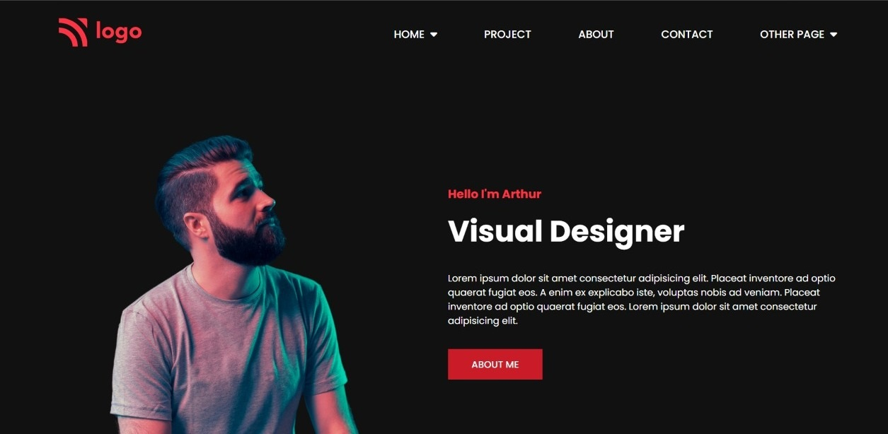

# Assignment-15 
## (Product design landing Page) 

> In this project, I have used HTML (the Hypertext Markup Language) and CSS (Cascading Style Sheets), which are two of the core technologies for building Web pages. It is a responsive page.

### As a result of this project, I learn the following:
[LIVE-LINK](https://projectproductdesign.netlify.app/)

- [x] used z-index to ordered the elements
- [x] I used font-weight to increase the boldness of the text.
- [x] used svg image path , margin and padding 

#### The duration of the project:6 hour